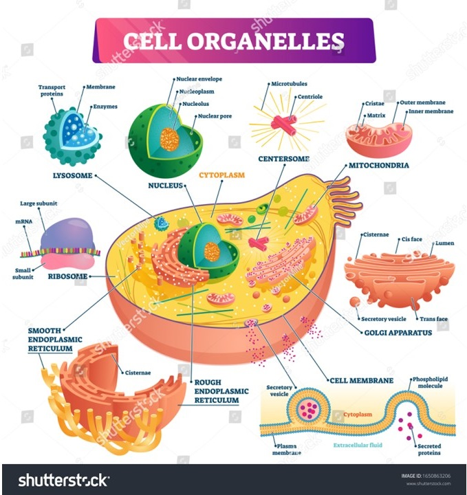
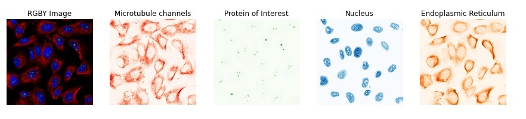
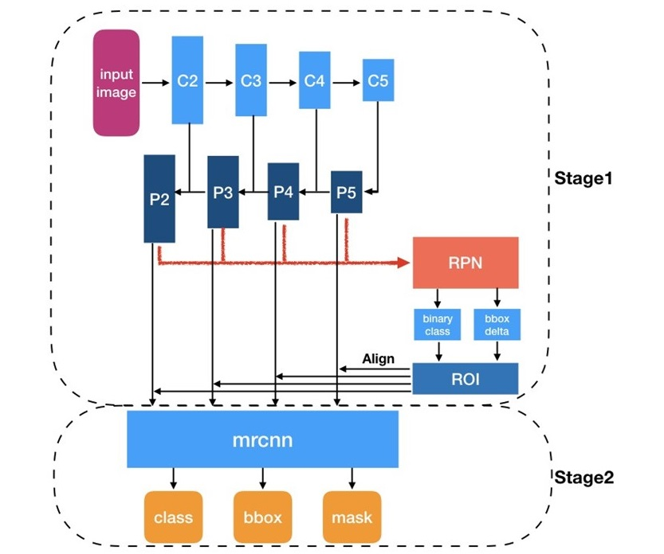

# Human-Protein-Atlas

https://www.kaggle.com/c/hpa-single-cell-image-classification

## Why is This Challenge Hard?
* My first image processing challenge.
* Rules specific to this challenge.
* Scoring metric is hard to develop.
* Submission file format.
* Notebook only challenge (all libraries have to uploaded. No internet access.)
* No logs.
* Public and private leaderboards. Not sure about the test set coverage.
* No available baseline.
* Large effort by Kaggle ‘grand masters’. “Is this only me, or does the ratio of grandmasters on the leaderboard to total number of teams seem extraordinary high in this competition?” (Darek K. 6’th place).
* Based on previous single cell classification challenge. https://www.kaggle.com/c/human-protein-atlas-image-classification.

## Challenge Overview
* Data: High resolution microscopy images of cells.
* Labels: Protein locations together for all cells in the image.
* Objective: Find protein localizations within a population of cells.
* Rational: Current machine learning models for give a summary of the entire population of cells only.
* Train: 87000 files of four channel images (150 GB).
* Test: 2236 files of four channel images.
* Labels: 
   + Image ID: 5c27f04c-bb99-11e8-b2b9-ac1f6b6435d0, labels: 8|5|0
   + Iamge ID: 5fb643ee-bb99-11e8-b2b9-ac1f6b6435d0, labels: 14|0

## Evaluation Metric
* mAP: Mean (over classes) of Average Precision for object detection
* Average Precision (AP): the area under the precision-recall curve
  + The confidence values are critical for this metric
* For the PASCAL VOC challenge, a prediction is positive if IoU ≥ 0.5

## First Attempt
* Use Mmdetection framework
* Very large model zoo
* Fifth place solution
* Black box approach using pipelines
* MaskRCNN

## Second Attempt
* Use only single label images.
* Using CellSegmentator we can focus on each cell, and train a classifier with known labels.
* Resnet50
* Resize to 1024x1024 pixels
* ImageNet normalization
* Metrics: accuracy, precision
* Loss: Initially cross entropy
* Second model, for each image:
   + Use cell segmentator to create a mask
   + Calculate bounding boxes using OpenCV
   + Cut out, pad to square, and resize each box
   + Get slide predictions using the first model
   + Keep only highly confidence classes
   + Automate for parallel run
   + Problem: Cell Segmentation Does Not Scale
   + Solution: using Cellpose, adding flow considerations to solve watershed algorithm multi basin problem. https://www.cellpose.org/

## Class Imbalance
* Data augmentation
* github.com/albumentations-team
* Class weight
* Focal Loss
  + https://arxiv.org/abs/1708.02002
* Multi label stratified K-fold
  + https://github.com/trent-b/iterative-stratification
* More data
  + 82495 images from HPA

## More Optimizations
* Class activation maps for confidence.
* GRAD-CAM
* Puzzle-CAM, https://arxiv.org/abs/2101.11253.